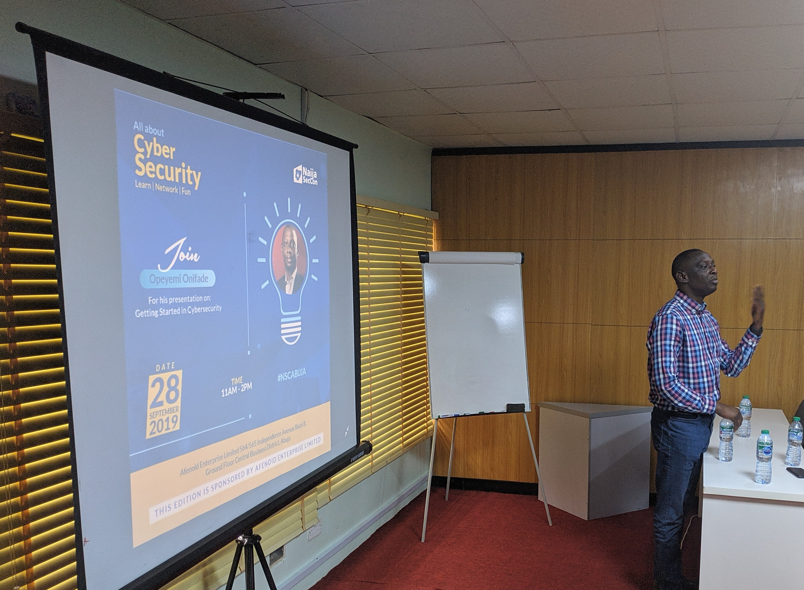
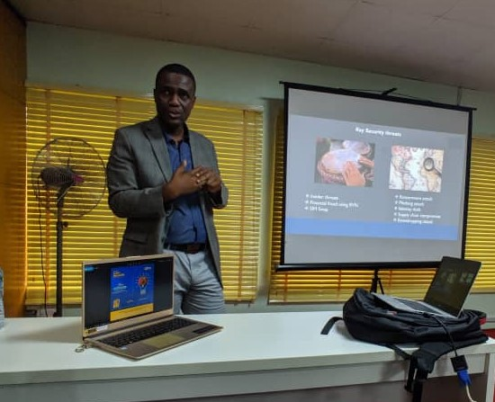

#### Yassss!!!

NaijaSecCon held its first Abuja Meet-Up on the 28th of September,2019 after the long wait (smiles). 

It was a great meetup as there were industry veterans who were available to give talks on various interesting topics and also amazing participants.

Mr Onifade Opeyemi who is the CEO of Afenoid enterprise gave a talk on “Getting started in cybersecurity”. There are a lot of people out there who are trying to venture into the cybersecurity field. His talk gave an insight on cybersecurity – a field that addresses personal, business and national security. Being ethical is a core for cybersecurity professionals.
You need to be ethical and being ethical gives you an insight on what to do and having the right to do it because you really don’t want to go to jail for using your skills unethically
Mr Onifade also told participants how writing certification exams can help through their journey in the field. Certifications will always act as a push for improvement in the pursuit of professionalism. Considering the fact that certifications are very expensive, He added that “You will never have the money for certifications. 
Just save and do it”. Credibility which is a combination of trustworthiness and expertise is very important in building up a career in cybersecurity
Being a competent professional entail having knowledge, skills and behavior and there is a need to pressurize yourself into getting better if you want to excel in the industry.

The second speaker Mr Glory Idehen - an assistant director at central bank who is also the current president of ISACA (Abuja chapter) talked on “Risk based NIST cybersecurity framework”. He began by emphasizing on how IT and Security exist to support the business. And not the other way around. Professionals should marry security and IT to support business
as this will fasten convincing managements to buy into security and IT implementation by allocating necessary funds.

The Risk-Based NIST framework can help improve investment decision that organizations needs to make towards cybersecurity.  The Risk-Based NIST framework helps organizations to;

* Understand what they want to protect (Ranging from Asset to organizational Data)
* Answers the question of how to protect them (by providing list of controls/measure on   how   they to be implemented)
* Understand various threat that assets are exposed

The process of answering all of these questions provide organization with their current state analysis, which will have help to fully identify all necessary risks and their likelihood of occurrence.
Actions taken on the current state analysis will move an organization to the Target Security State (as defined by the organization).

Miss Oloyede Olajumoke Elizabeth who is a cyber threat intelligence analyst spoke about the “Nigeria G-cycle: A threat to National security” which is popularly known as yahoo boys. She gave instances of how scammers obtain Personal identifiable information (PII) and this includes phishing emails and text messages, fake job adverts, social media fake online quizzes and surveys and also remote access. 

There are factors for the prevalence of yahoo boys(as it is popularly called) in Nigeria and this includes Values and cultures, music, online resources, unemployment, cybersecurity ignorance and also greed. This has left the integrity of Nigeria and Nigerians in shambles. “The moral and ethical code of a country is how citizens of a country are viewed and judged”.
Hence,it is important for Nigeria and Nigerians to put in extra measures in promoting the integrity of the country  by being good ambassadors.

The meetup was very enlightening and rich in contents as participants cannot wait to have another meetup soon but best believe the next will be another with Amazing speakers and rich contents. 

## You hate to miss it!

#### About Author:
Hamzah Lateef is a cybersecurity engineer who manages and support endpoint and Network security.He has implemented and managed cybersecurity projects 
