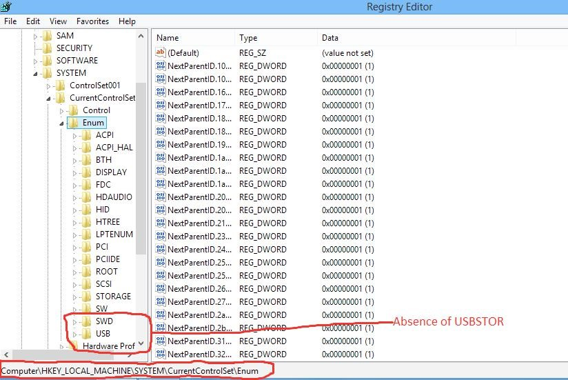
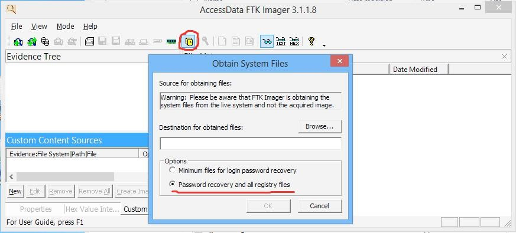
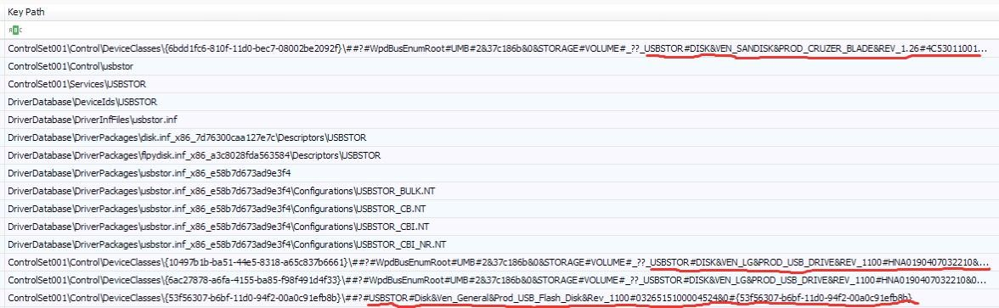

              ## THE USB TRAIL: ANTI-FORENSICS AND ANTI-ANTI-FORENSICS BITTER ROMANCE

                                        by Chidi Obumneme

USB Mass Storage devices come in several small sizes, capable of usage as attack tools against any group or organization. To this effect, researchers from Ben-Gurion University in Israel have discovered 29 ways USB devices can be used to attack and compromise computer systems. Likewise, the Insider Threat is a very great security risk posed to groups and organizations largely because of their privileged access to sensitive or proprietary information. These Insider Threats can leverage on their positions and decide to Exfiltrate Company Trade Secrets and sensitive information with the aim of selling same to competing organizations.

Exfiltration of proprietary data via USB Mass Storage devices proves a certain way to conduct this form of attack. Since every attacker’s aim is to cover every track of some form of misdeed, it is therefore the duty of the Digital Forensics Analyst to prove that such attack took effect, which is therefore the crux of this article – to prove the conduction of an attack using the USB device despite attempts by the attacker to clean up their tracks by employing anti-forensics techniques.
 

### INTRODUCTION

In certain organizations, insertion of USB Mass Storage devices is hugely disallowed, which stems from an attack point of view, where it could be used to transport compromised data into the company systems, as well as stealing company data. Despite such “no-USB” policies, threats from disgruntled employees utilizing such devices are still rife. Therefore, unravelling the activities of insider threats (with respect to usage of USB Mass Storage devices) is needful, hence this article.

The article underscores the importance of USB forensics as it highlights the fact that the usage of USB devices on systems leave footprints, which the normal user is not usually aware of. To the sophisticated attacker, the need to cover tracks will lead to employing anti-forensics methods to erase traces of USB usage on the system, with the ultimate aim of frustrating the Forensics Analyst.

### CASE STUDY

We present a typical scenario of data theft. Mr. XYZ of ABC Company has been relieved of his job based on suspicions that he has, on several occasions, stolen company trade secrets and sold them to the competitor. There is a need to establish this fact, that he has constantly stolen proprietary documents. The suspicion is pinned on the fact that he has always exfiltrated data through a USB Mass storage device despite ABC Company’s “no USB” policy.

In this article, the author will simulate the data exfiltration process, forensics, anti-forensics and anti-anti-forensics techniques on a freshly installed Windows 8 machine.

Looking at the Registry Editor (regedit.exe), in the figure below, we can clearly see that USB Mass Storage devices have not been used on it. This is clearly known by the absence of the USBSTOR key, which ordinarily is found in Computer\HKEY_LOCAL_MACHINE\SYSTEM\CurrentControlSet\Enum \USBSTOR.
 

     

The USBSTOR key records details of every USB Mass Storage device that is used on any Windows system and, as such, the absence of it in the above picture clearly indicates no USB storage device has been inserted into the machine.

The picture above shows the devices that were used to simulate the attack

In Figure 3, the Registry Editor shows us the creation of the USBSTOR key after USB devices have been inserted into the system to carry out the task intended by the attacker. If you note carefully, apart from
the USBSTOR key, a newly created key is seen (Figure 4) and it contains juicy information that relates to insertion of USB Mass Storage devices.

### ANTI-FORENSICS

Being one of the phases of hacking, attackers are interested in clearing their tracks. Since the usage of USB devices leave notable traces, as seen above, clearing such tracks will then be sought by the attacker. USBDeview is a tool that can be used to list all USB devices that have been used on a machine. It also has the capability to clear traces of USB device usage. It displays the drive letters each
USB device makes use of when inserted into a machine and you can select each of the devices you want deleted, do an uninstall and the device is cleared from the list.

In uninstalling, according to Figure 6, a prompt is displayed to ensure the attacker wants to clear the selected devices. Clearing tracks with USBDeview is just a step the attacker feels has not really done a great job. The attacker feels this way because anybody who runs the USBDeview utility on a later date will not see the deleted devices displayed but certain other trails of the USB Mass Storage devices still exist on the machine. As shown earlier the Registry is one place that will definitely expose the attacker and the particular devices he has used to carry out his attacks. It then behoves the attacker to clear traces recorded in the Registry. Since USBDeview is not capable of clearing the Registry of USB tracks, USB Oblivion is executed. This utility is very effective in cleaning the Registry of the USBSTOR key (and other related keys that record traces of USB Mass Storage device usage) and viewing the Registry Editor will clearly indicate its effectiveness.

Since a thorough job needs to be done, ensure the “Save backup .reg-file” is unchecked. The other options are important to be selected to ensure the anti-forensic technique is well carried out.

After the system restarts, the Registry Editor is checked to see what job the USB Oblivion carried out. The figure below, to anybody who views it, will indicate that no USB Mass Storage device has been used on this system due to the absence of the USBSTOR key. Despite the presence of the ‘Computer \HKEY_LOCAL_MACHINE\SYSTEM\CurrentControlSet\Enum\WpdBusEnumRoot\UMB’ key, it appears empty and as such it cannot be proved any device has been inserted into the machine.

### FORENSICS and ANTI-ANTI-FORENSICS

The attacker has succeeded in clearing his USB usage tracks and now the Digital Forensics Analyst must prove that certain storage devices were used on the machine. Another thing which needs to be proved by the Analyst is that data was exfiltrated. The picture below proves that data exfiltration actually took place on the machine – presumably, the files belong to the company and were copied into F:\FOUND.000 folder and viewed from there. A link parser that displays .lnk files is executed.

Viewing the C:\Windows\Prefetch folder as shown below, the use of the anti-forensic tool USB Oblivion is seen, which will give the Forensics Analyst the inclination that the Registry has been tampered with.

The next step will be to extract the Registry hives to forensically examine them and determine what data must have been tampered with. To do this, Accessdata FTK Imager is used for the extraction, through the ‘Obtain Protected Files’ option. This is shown in the below picture.

Presently, we are more interested in the SYSTEM hive and we simply extract it to our Analysis machine. The extracted file is opened with AccessData Registry Viewer to have an idea of what the hive has to offer the Forensics Analyst. What meets the Analyst proves nothing as the USBSTOR key is clearly absent and there is no trace of any form of deletion, leaving the Analyst further frustrated.

With the above processes, the Forensics Analyst may begin to become frustrated as there seems to be no indication of any deletion. Let us not forget that locating the usage of USB Oblivion in the Prefetch folder is the driving force towards locating the deleted Registry keys that hold evidence against the attacker. To eventually end the case and secure a win against the attacker, the Registry Explorer is used to view the extracted SYSTEM hive.

From the above pictures, traces of the deleted Registry keys are seen and one can hereby conclude that USB Mass storage devices were inserted into the machine, data exfiltrated and traces of the devices usage deleted to hide evidence.
 

## CONCLUSION

The article has modestly created a process that will lead to proving that despite the anti-forensic technique employed by a sophisticated attacker, digital footprints can still be left as evidence that can be gleaned by the Digital Forensics Analyst.

Therefore, it should not be wrong for the author to conclude that for every anti-forensic method employed, an anti-anti-forensics method exists to prove it.

### About the Author:

