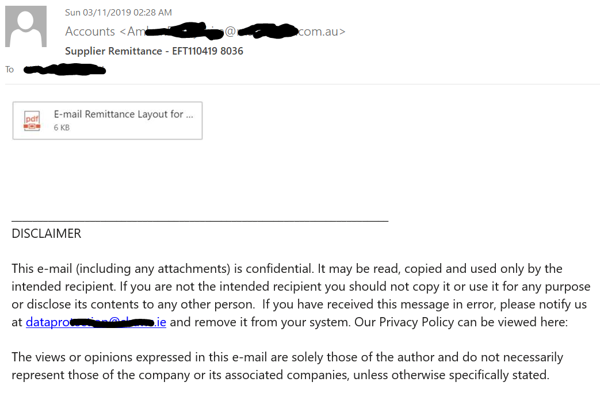

## Time Frame
3rd November, 2019 - Current

## Overview
The NaijaSecForce team have detected a new wave of malware spreading across Africa and the Middle East. This malware comes in form of a spam campaign targeting corporate mailboxes within Africa and the Middle east.
We started receiving reports of this malware campaign on the 3rd of November. The pyrogenic malware started initial propagation in August 2019 – but then, it went quiet till November 2019 when we noticed a massive spike

## Technical Description

At first glance, it looks to be a simple, harmless email with a supposed attachment. However, on closer look, what looks like an attachment, is an image with a hyperlink.

