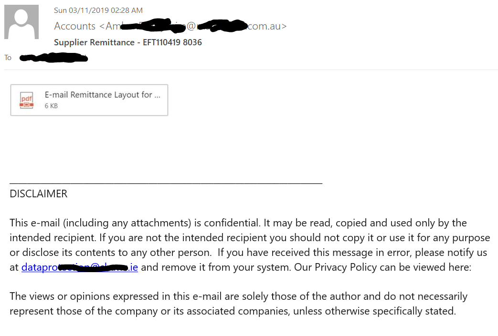
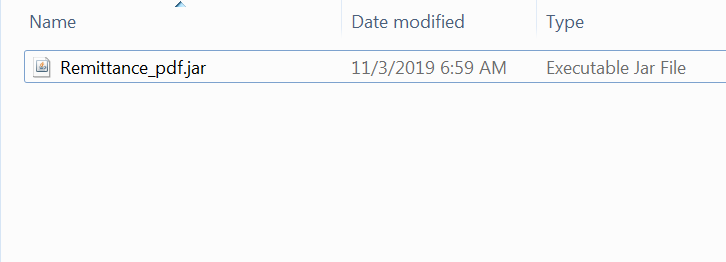
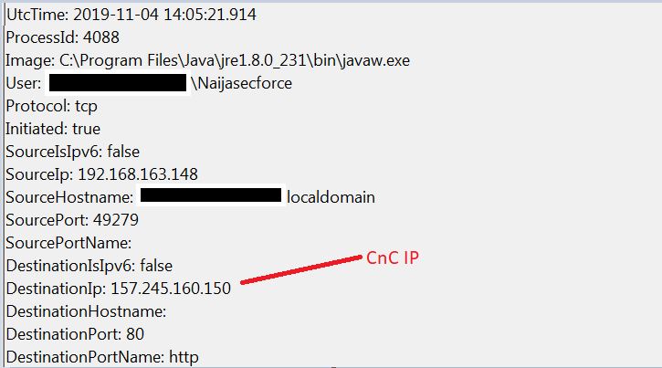
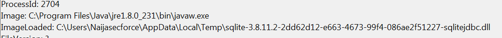
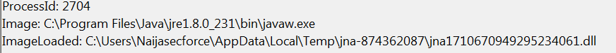
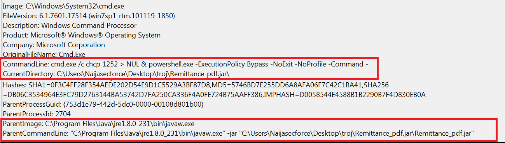
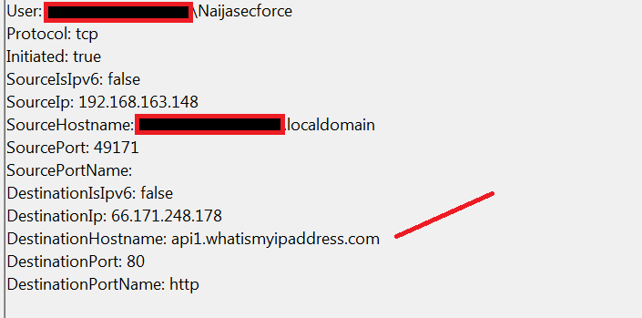
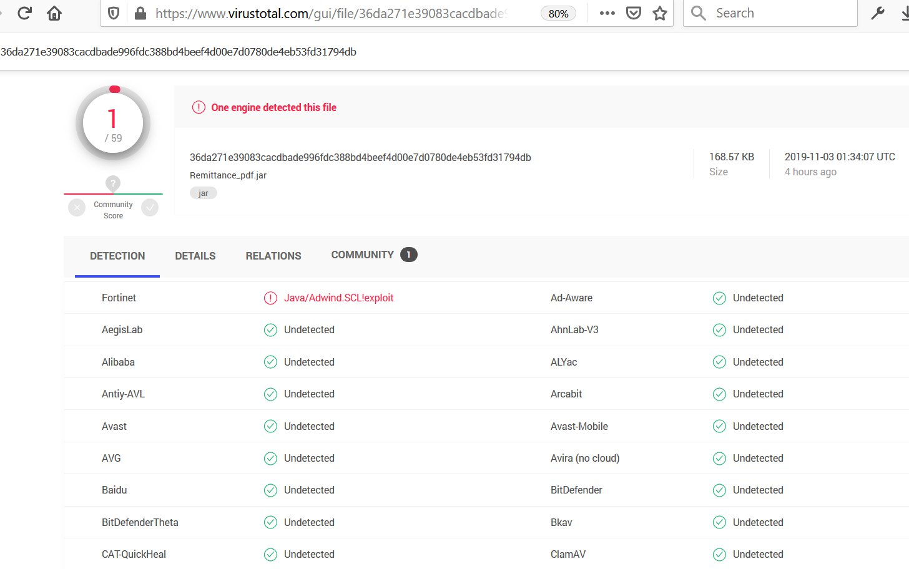

## Time Frame
3rd November, 2019 - Current

## Overview
The NaijaSecForce team have detected a new wave of malware spreading across Africa and the Middle East. This malware comes in form of a spam campaign targeting corporate mailboxes within Africa and the Middle east.
We started receiving reports of this malware campaign on the 3rd of November. The pyrogenic malware started initial propagation in August 2019 – but then, it went quiet till November 2019 when we noticed a massive spike

## Technical Description

At first glance, it looks to be a simple, harmless email with a supposed attachment. However, on closer look, what looks like an attachment, is an image with a hyperlink.

The hyperlink is https[:]//bandirmaad[.]com/RA.html and it redirects to cevrimiciciftci[.]com/Remittance_pdf.jar where a file gets downloaded to the victim’s PC.

This malware relies on the victim to open the .jar file. The malicious .jar file is portrayed as a “Supplier Remittance” pdf file, which is a fairly typical lure used in malware campaigns.
Upon launching the malicious file “Remittance_pdf.jar”, we noticed an outbound connection to the CnC server 157.245.160.150 on port 80.

Shortly after, two DLL files get dropped and loaded,it created a file - ImageLoaded: C:\Users\Naijasecforce\AppData\Local\Temp\sqlite-3.8.11.2-2dd62d12-e663-4673-99f4-086ae2f51227-sqlitejdbc.dll

ImageLoaded: C:\Users\Naijasecforce\AppData\Local\Temp\jna-874362087\jna1710670949295234061.dll

## CMD.exe Launches for Command execution.
We also noticed that cmd.exe automatically launches spawning off a powershell command.

CommandLine: cmd.exe /c chcp 1252 > NUL & powershell.exe -ExecutionPolicy Bypass -NoExit -NoProfile -Command -

The Trojan then connects a remote location (api1.whatismyipaddress.com)to gather the external IP address of the compromised computer:

## Current Detection

We ran this malware against Virustotal and had only 1/59 detections.Only fortinet detected the malware.

| S/N | Description| Detailed Information |
| --- | --- | ---|
| 1 | Malware Hosting sites (links in email) | hxxps://cevrimiciciftci.com/Remittance_pdf.jar, hxxp://bandirmaad.com/RA.html |
| 2 | Malicious Filenames Observed | Remittance_pdf.jar, BankPaymAdviceVend_LLCRep.jar, Remittance_Advice(E-Mail)_pdf.jar, E-mail_Remittance_Layout.jar, Remittance_Advice_IN33092319_pdf.jar, Remittance_Advice_HEAD0000I00231_pdf.jar |
| 3 | File Hashes for Malicious File (.jar) | sha256: 36da271e39083cacdbade996fdc388bd4beef4d00e7d0780de4eb53fd31794db 6e8cf485eacacfc00e3dcb5049c6c49230f8f845949ef24794eb457e0a27b7fc 43bb377d987a5f845b8d743d1d0388cb3cbe38d9aef4569c40fb14c48fbedcc0 20a28b1564fdfb9efef85cb3d48788a44dab8c1ce40754a6f6c666608fe74bf7 a3d5b263586c997d4420565fea863dca93697b1587e6e72fce36b96a8e55ae27  |
| 4 | Dropped executable file and Hashes | %temp%/sqlite-3.8.11.2-2dd62d12-e663-4673-99f4-086ae2f51227-sqlitejdbc.dll Sha256: 51cc105f172859e6866f3cad5c99188663be503cd4bb618c946b0c83faabf0b8 %temp%/jna-874362087\jna1710670949295234061.dll Sha256: 1b2af8b31416f68051db213bcdcf82775e29191b6d069c327988e02e654030ad  |
| 5 | DNS requests | bot.whatismyipaddress.com |
| 6 | Network Connections | 157.245.160.150 66.171.248.178  HTTP/HTTPS requests hxxp://bot.whatismyipaddress.com/ |

## Recommendations
In order to avoid and mitigate the impact of the threat, we highly recommend the following:
* Ensure that all IOCs are blocked.
* Avoid and restrict execution of unknown files / programs / powershell scripts.
* Ensure that attachments and links in emails are sandboxed analysed before delivery to users.
* Monitor emails for any phishing activity and malicious links/attachments.
* Monitor the network for any suspicious/anomalous activity
* Implement more cybersecurity awareness workshops
* Communication to the malicious Command-and-Control server should be blocked.
* Malicious domains should be blocked using URL filterring for web security.security

###### Credits to AppAnyRun for the name “Pyrogenic”.

## About the Author:

