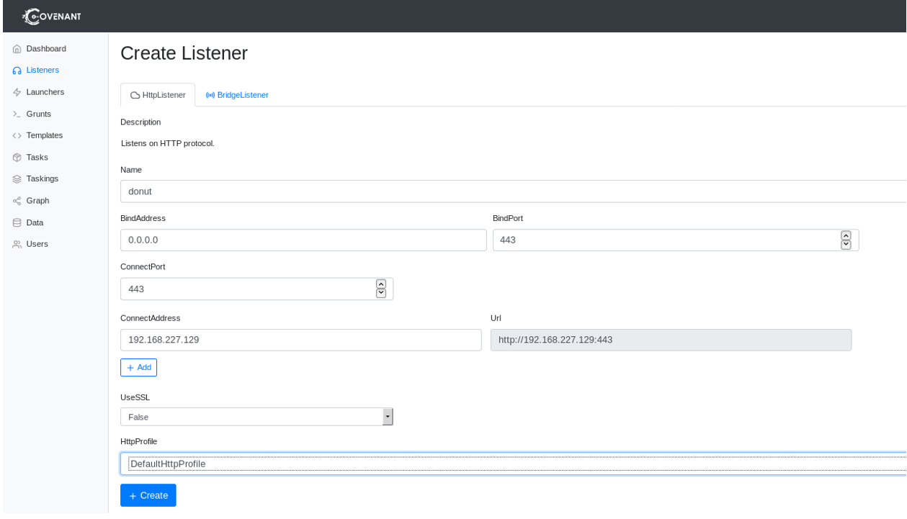
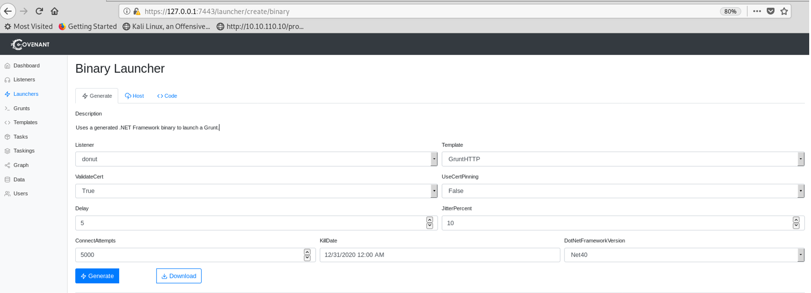
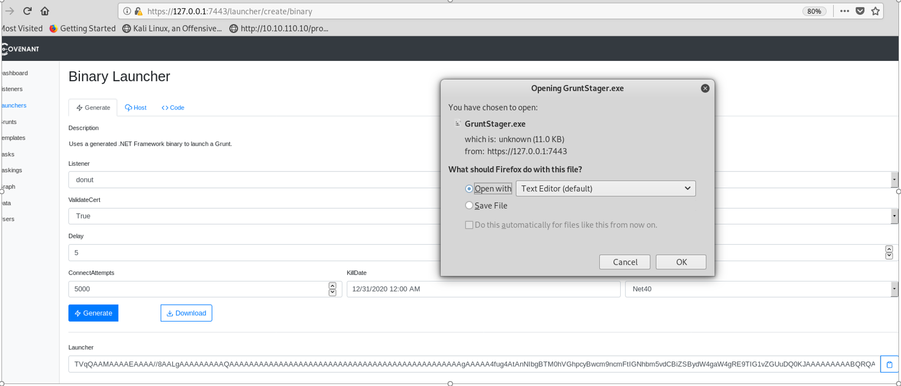
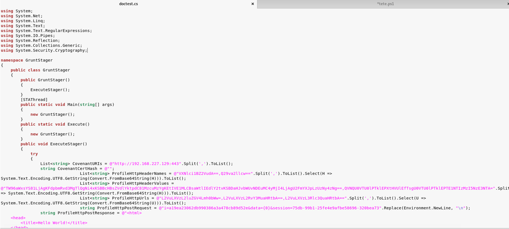
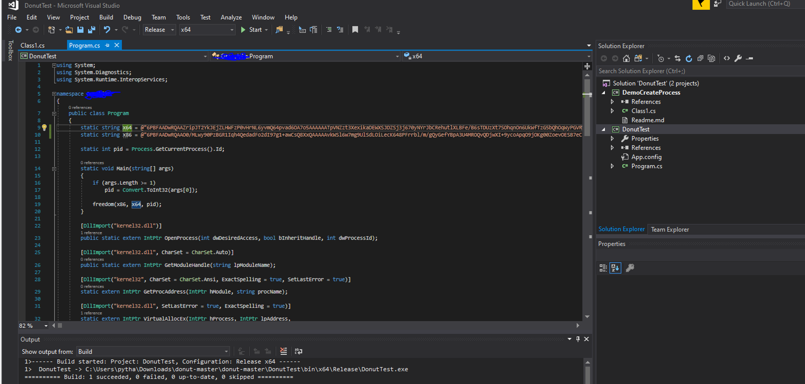
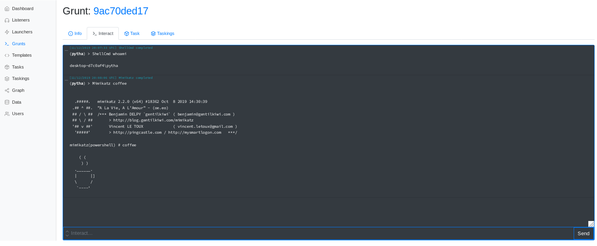

## Overview
Red Teaming has rapidly transitioned from Living off the Land (LotL) to Bringing Your Own Land (BYOL). 
It is now possible to execute .NET assemblies entirely within memory. By developing custom C#-based assemblies, 
attackers no longer need to rely on the tools present on the target system; they can instead write and deliver 
their own tools, a technique called Bring Your Own Land (BYOL).  This has led to transitions from PowerShell tools 
(e.g. PowerShell Empire) to frameworks targeted for .NET assemblies. [shamelessly copied from this source](https://www.fireeye.com/blog/threat-research/2018/06/bring-your-own-land-novel-red-teaming-technique.html)

## About Covenant
Covenant is a .NET command and control framework that aims to highlight the attack surface of .NET, make the use 
of offensive .NET tradecraft easier, and serve as a collaborative command and control platform for red teamers. 
Covenant is an ASP.NET Core, cross-platform application that includes a web-based interface that allows for 
multi-user collaboration.

_Figure 1: Covenant dashboard showing Grunts (active PWNED systems), listeners and executed tasks_

The dashboard above is one of the major goals of red teamers, i.e., ability to communicate with payloads installed/executed on victims’ machines while bypassing security controls such as Anti-Virus (AV) and Event Detection and Response (EDR) solutions.

## Installation and more reading
Further information is well covered by the author - Ryan Cobb at the [Wiki](https://github.com/cobbr/Covenant/wiki)

## Current use of Covenant
This methodology below might be out-dated by the time you are reading this, but as at 13th of November, 2019, it was effective at evading well known EDR and Windows Defender (the anti-virus).

**Dashboard components** – A high level view showing compromised systems (referred to as Grunts), active listeners, and tasks that have been executed.

## Configuring a listener
This shows the configuration of an active listeners called “donut” in this case. Click on “Listeners”, then  “Create”.

Configure the Name, BindAddress, BindPort, ConnectAddress and ConnectPort.

Once the listener is created, it shows up in the Listeners view ready to receive connections from Grunts (compromised systems).

Next step is to use the Launcher menu to create a payload that would be executed on the victim’s system. The available launchers are shown below. In my example, I will be using the “Binary” launcher to generate a payload.

Select the created listener “donut”, “template” and depending on the victim’s .NET framework, select an appropriate DotNetFrameworkVersion (Net40) works in most cases as Windows 10 comes with it by default. Click “Generate” and then the “<> Code” tab to see the C# code.

You can also download the binary file as shown below, but Windows Defender has caught on to the Covenant Binary, as it is now detected in its default configuration.

To evade this detection, we copy out the C# code and paste into a file called “doctest.cs”.

Find & Replace keywords like “Grunt”, “Stager”, “Execute”, “Covenant” and any other that might trip the antivirus. New modified c# file should look like:

Compile the file using visual studio to generate a “doctest.exe” which can be copied to the victim system and executed to get a reverse shell.

However, most AV/EDRs have started preventing processes from loading assemblies using Assembly.Load (which is a technique that Covenant heavily relies on), thus it is almost impossible to issue further commands after getting the reverse shell as shown below:

## Introducing Donut
Donut generates x86 or x64 shellcode from VBScript, JScript, EXE, DLL (including .NET Assemblies) files. This shellcode can be injected into an arbitrary Windows process for in-memory execution. Given a supported file type, parameters and an entry point where applicable (such as Program.Main), it produces position-independent shellcode that loads and runs entirely from memory. More information can be found [at this location](https://github.com/TheWover/donut)

Donut provided a solution to our initial problem of loading assemblies into memory, it provided a way of converting executables (such as those generated by Covenant) into shellcode, which is easy to inject into compatible running processes.

Here we issue a donut command to generate an x64 shellcode of our covenant payload (doctest.exe)
The shellcode is generated as “doctest.bin”

The next step is to inject this shellcode into a running process with the same architecture. Also, note that injecting into a process affect the process (maybe not crash it, but might make it slower or non-reactive). Usually one can spin up a notepad and inject into the notepad process which should not cause any operational issues except that the tested EDR might flag the fact that notepad is issuing OS commands :D (don’t run “ShellCmd” when using notepad process, instead run “PowerShell” commands, though this depends on your EDR config)

The generated shellcode files (for x86 and x64 bit process) are converted to Base64 and copied to clipboard using the command shown below:

They are pasted into an injector program ["DonutTest"](https://github.com/TheWover/donut/tree/master/DonutTest) and built in Visual Studio (or using csc, or any platform that can compile c#). This program is responsible for the injection of the shellcodes into a specified process ID.

Spin up a notepad program and check for the process ID (5132 in this case) using Ryan's [ProcessManager](https://github.com/TheWover/donut/tree/master/ProcessManager)

Execute the DonutTest program, providing the notepad process ID as an argument.

This should inject and execute the shellcode that is compatible with the process and give a revere shell on the Covenant C2.

We can now issue same queries as above without being detected by AV and EDRs.

This post only highlights one of many approaches for crafting payloads and also to introduce Covenant and Donut to give us an idea of how .NET tradecraft is evolving. For shellcode injection, I prefer to use a modified version of [UrbanBishop](https://github.com/FuzzySecurity/Sharp-Suite/tree/master/UrbanBishop) to do the job.

## About the Author:
Chinedu Onwukie is an experienced red teaming professional based in Canada. He has multiple years of management 
and technical security experience cutting across consulting, banking, technology and insurance industry.
