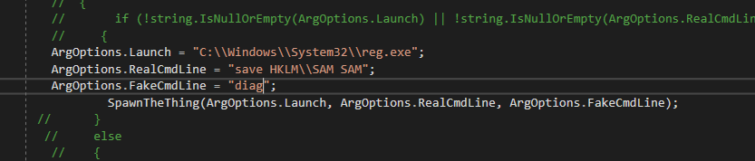

##  Winning Your "Arguments" with EDRs 

A recent client engagement had me thinking about ways to evade security tools that rely heavily on command line arguments. During a red team task, I wanted to dump the SAM database of the victim’s system, but I knew that commands such as “reg save HKLM\SAM SAM” would easily be caught by the installed EDR. This technique is well-known and documented under [Credential Dumping](https://attack.mitre.org/techniques/T1003/) in the MITRE ATTACK framework, so most EDRs should pick it up.

What about somehow modifying the commandline arguments with a fake one, one that’s definitely not on the EDR’s alert configuration. I later found out this has been implemented in Cobalt Strike 3.13, but I don’t have CobaltStrike ☹ yet. I encountered some online research work that has done very well in introducing and explaining this concept:
* Red Teaming in the EDR age - (https://www.youtube.com/watch?v=l8nkXCOYQC4) – Will Burgess
* (https://blog.cobaltstrike.com/2019/01/02/cobalt-strike-3-13-why-do-we-argue/ )- Raphael Mudge
* (https://blog.xpnsec.com/how-to-argue-like-cobalt-strike/) - Adam Chester

As I have grown fond of C# over the past few months, I looked for some existing C# code and noteworthy is FuzzySecurity’s “SwampThing”. It creates a process in a suspended state, rewrite the PEB, resume and finally revert the PEB. The PEB is like metadata for the process and contains the commandline arguments. In the suspended state, the PEB is identified and the benign arguments are switched to the malicious ones. When process is then resumed, Windows records the benign arguments, but it is the malicious ones that are executed.

For example: SwampThing.exe -l C:\\Windows\\System32\\notepad.exe -f C:\\fake.txt -r C:\\real.txt

Examination of the sysmon logs show that the fake arguments were logged, but there is the problem of the ParentCommandLine as shown below, it gives away the arguments, and a good threat hunter should catch this easily.

A simple way to avoid this detection (to an extent) is to modify the SwampThing source code and hard-code the arguments within the source code, recompile and run. An example is shown below: trying to dump SAM, SECURITY, SYSTEM in order to extract the local credentials.

Before execution, rename SwampThing.exe to something more generic (DiagReg.exe) in a good location on disk (C:\Windows\System32\). Recompile the source code and execute on the victim system. This should dump the SAM file to C:\Windows\System32\SAM. Repeat this for SYSTEM and SECURITY.

A look at the logs shows the fake arguments and it sort of looks legitimate 😉

Once this is done for SAM, SECURITY and SYSTEM, one can use impacket’s secretdump.py to dump extract the hashes.

This process was replicated on a system with well known EDRs and AVs without detection. Blue teams should ensure their threat hunt game is up and running. Also note that this method just tries to bypass the command line detection rule sets, its not a silver bullet for it. Success depends on the rule sets in place.

## About the Author:
Chinedu Onwukie is an experienced red teaming professional based in Canada. He has multiple years of management 
and technical security experience cutting across consulting, banking, technology and insurance industry.

Source: [secureallofus](https://secureallofus.blogspot.com/2019/11/winning-your-arguments-with-edrs.html)
