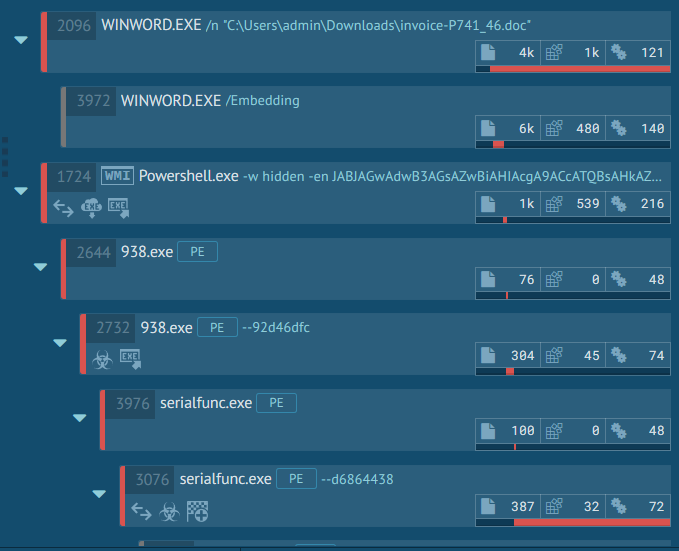

## Time Frame
Q4, 2019 till date (9/12/2019)

## Overview
Starting from late November, 2019 till now (9th December, 2019), the NaijaSecForce team detected a surge in Emotet spam campaign targeting corporate mailboxes within Africa and Globally.
Emotet is not new as it was first recorded in 2014. Emotet is an extremely sophisticated and destructive banking Trojan used to download and install other malware. 

## What makes Emotet virus so dangerous? 
According to an article by [AppAnyRun](https://any.run/malware-trends/emotet), Emotet can act like a worm and spread using local networks, which makes it extremely hard to clean-up. In addition to this, the Trojan has advanced persistence and anti-evasion mechanics, such as the ability to detect sandboxes and virtual machines with an option to generate false indicators to throw researches off. On top of that, the Trojan has a polymorphic design – meaning that it can change its code to bypass signature-based detection, making this cyber defense strategy useless against its’ attacks.Today Emotet is targeting governments, corporations, small businesses and individuals, focusing on Africa, Europe and America.

## Technical Description
The new emotet malspam is sent via an email with a hyperlink (samples below).

These emails pick an employee’s firstname, lastname, adds it to the sender’s name and also to the signature – and then spams other employees.

In some other cases, it picks a compromised email address from a contact, goes through email exchanges and then replies to the existing email chain with the hyperlink or the malicious word document.

Upon clicking the URL embedded in the email, a word document gets downloaded. In this case, Invoice-XXXXX.docx

Opening the word document, you get presented with this;

When you click on “Enable Editing”, a powershell script runs in the background.

The powershell script runs and downloads a binary from 5 different URLs as per below;

The binary gets saved as XXX.exe (where XXX is a number), in this case C:\Users\admin\938.exe which then gets renamed as serialfunc.exe and gets saved to C:\Users\admin\AppData\Local\serialfunc\serialfunc.exe.It then starts communicating with CnC servers.

## Emotet Process Tree

## Indicators of Compromise
Refer to [cryptolaemus](https://paste.cryptolaemus.com/) for daily update on IOCs for Emotet.

## Some Common Emotet Email Subjects we have seen;
* Enppi Dualization, Engineering, Procurement and Construction of the egypt
* Request For Quotation Contract#721134
* Rejected transactions
* NOTICE FROM CENTRAL BANK
* Re: CAPE Payment; DD Quotation Dock/ Invoice
* Re: Re: Re: Re: URGENT / RE: Request for Quotation
* NOTICE OF ARRIVAL FOR (AWB) # 340650648***FINAL NOTICE
* Re: open invoice
* Automatic reply: FBC Upcoming Events - Register now
* Month invoice
* Your Invoice
* balance payment
* RE: Good Standing Letter/Opinion Letter for subsidiary
* RE: NEW ORDER 38617
* RE: PO/PI1920267/DEC/-
* RE: STATEMENT OF ACCOUNTS
* Re: Confirm outstanding Invoice_Ref-6655.H978
* Inward Remittance Notification (MT 103)
* RE: NEW ORDER FOR CONTRACT CN#1949936
* Updated Statement of Account
* RE: PO Notice_0191209_1
* MV ROSCO LEMON
* Parcel Held At Our Facility (Arrival Notice)
* QUOTATION RFQ
* RE: Scan Copy
* PURCHASE ORDER: #0298-1212019
* FW: Swift for payment
* FW: Payment Swift
*Review P.O#_0084645
* NEW PO#P21S-19110166
* Please review and approve. Thank you.
* NEW ORDER No. 00181356-1074
* PURCHASE ORDER \| T001407 \|
* RE: Request for Spare Parts price offer 1285
* Attention: Outstanding Bill
* Invoice  7077601
* 12/2019 Invoice
* Payment Advice - Advice Ref:[GLVB29148726] / Priority payment
* Invoice for Service
* CREDITED USD.
* Purchase Order
* Payment Advice-BCS_ECS9522019111121380024_1206_952

## How Do We Check if We are Currently Infected by Emotet and How Do We Mitigate this?
* Monitor inbound emails for impersonation attacks – i.e. your domain name is example.com and you have an employee who is john.doe@example.com . Check inbound emails and review emails that matches an internal user display name john.doe@xyz.com 
* Perform an AV/EDR scan for all infected machines
* Block all IOCs and carry out a threat sweep to see if IOCs exist within your environment – hashes, IPs, domains, filenames, etc.
* Check for persistence as Emotet uses various techniques to ensure that the malware still persists on the infected host.
* Disable macros with notifications in Microsoft Office Trust Center Settings.
* Avoid and restrict execution of unknown files / programs / powershell scripts.
* Ensure that attachments and links in emails are sandboxed analysed before delivery to users.
* Monitor emails for malicious links/attachments.
* Monitor the network for any suspicious/anomalous activity
* Consistently rollout cybersecurity awareness workshops/training.

## About the Author:
#### NaijaSecForce Threat Advisory Team - Rotimi Akinyele 

NaijaSecForce Threat Advisory Team includes security experts and researchers responsible for analyzing and eliminating threats within Africa and also, investigating the global threat landscape. The team shares its research and insights with the industry at large to help promote a safer internet. 

The NaijaSecForce Threat Advisory Team is under the body of the NaijaSecForce team which is the brain behind NaijaSecCon – a conference dubbed as Nigeria’s foremost technical cybersecurity conference which holds annually.

