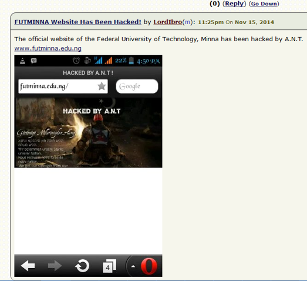
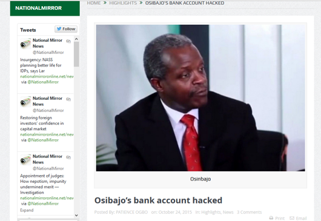
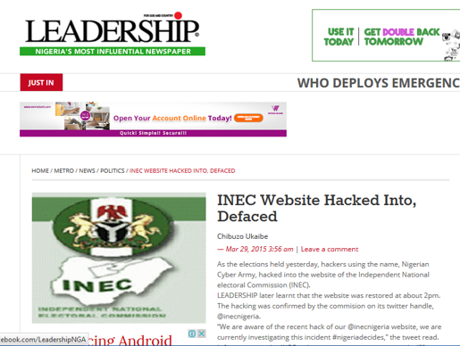

The way we talked about Cybersecurity in this decade was like never before. One cannot write about 10 years of Cybersecurity in Nigeria without revisiting some of the major events preceeding this period, which had set the ball rolling for the developments witnessed. The question to be answered here is, “Did we improve?”.

Let's go through the ride together 😊

# In preparation for the decade (Before 2009)

The years before 2009 in Nigeria, witnessed some major events in Information Communication Technology, which made it more important for the country to buckle up in the area of Cybersecurity.

Prior to 2009, Nigeria’s telecommunication density was nothing to write home about. We did not have mobile phones in our hands, and the government made some decisions on how to improve this situation, a journey that was kick-started in 2001. This singular step improved communication and businesses became interconnected within the country.

About this time as well, [NITDA](https://en.wikipedia.org/wiki/National_Information_Technology_Development_Agency) was birthed with the sole responsibility of developing a program that caters to the running of Information Communication Technology (ICT) related activities in the country. A bill was passed into law (**NITDA Act 2007**) to officially enact this power and responsibility six years after its birth. This move was aimed at creating an enabling environment for the implementation of ICT across board (private and public sectors) and digitization of many manual processes of doing things in Nigeria.

Following these developments, [Galaxy Backbone](https://galaxybackbone.com.ng/) commenced operation in 2006 as the information technology and shared services provider of the Federal Government of Nigeria. **Galaxy Backbone** plays a key role in the development and deployment of technology initiatives and services in government, working with the master plan for e-Government in Nigeria, a goal that was set for the year **2020**.

In similar fashion, [NIMC](https://www.nimc.gov.ng/) was establishe9d to create, operate and manage Nigeria's national identity card database, integrate the existing identity database in government institutions, register individuals and legal residents, assign a unique National Identification Number(NIN) and introduce general multi-purpose cards. This was a sign that the country had started collecting **data** in digital formats.

**Internet Cafes (_often referred to locally as Cybercafes_)** became a lucrative business, as many centers began providing Internet access to young, teeming Nigerians in remote towns and cities. This opportunity to access the world from a small screen gave the youth, who later dominated the next 10 years the opportunity to learn.

Albeit, most people were  uncertain of what exactly to learn, given the plethora of information available online. Some people took interest in blogging, while others  explored ICT skills such as networking, programming, and web development. One thing that cuts across all these individuals though is the use of Social Media, which brought them significant exposure in whatever path they chose.

Nigeria conducted it’s [Census](https://en.wikipedia.org/wiki/List_of_Nigerian_states_by_population) exercise across the country, which produced a figure of about 140 million. A sure sign of moreopportunities to be exploited for businesses.

> Banks would play a major role in the decade that was about to come in 2009 especially in the area of Cybersecurity and information security in general. But many events happened in the years before, which really helped to prepare them for the challenges ahead. The first of such challenges was the banking reform conducted by the Central Bank of Nigeria (CBN) in 2004. Weaker banks could not continue operations, while some remained in business only after a merger. This process gave us strong banks that were ready to compete with their international counterparts.

This was a testament to the saying that, “You won’t know who is strong yet until there is a crisis”. It was in 2008, when [the global financial crisis rocked the world](https://en.wikipedia.org/wiki/List_of_Nigerian_states_by_population) and our presumed strong banks were meant to scale through this crisis, however, up to five banks got acquired in a day by the CBN, their leadership was changed and handed to [AMCON](https://amcon.com.ng/). This crisis gave us even stronger banks that scaled their operations with technology. All of this happened just a year to the beginning of the new decade.

Unfortunately, Nigeria had already been associated with the [Advanced Fee Fraud (419)](https://en.wikipedia.org/wiki/Advance-fee_scam) scam on the global stage as several persons had latched onto these illegal activities thus giving the country a bad reputation.

# In this Decade (2009-2019)

Events of the years before had taught individuals how they could utilize ICT to their advantage and exposed many businesses to the idea of leveraging ICT in their daily operations.

As of early 2009, we could count the number of [Tertiary institutions](https://www.informationng.com/2009/07/nigerian-universities-websites.html) which had implemented some form of Online Web Portal system. A short while after, these numbers have soared and it appears there are even competing portals for similar activities.

**Digital banking** then sprung up as payment systems were been digitized. Online payments were available via bank-issued vouchers which would then be used on web portals as Debit/Credit cards were not yet available. For most of those who implemented this approach, the focus was “making things work online” and less on “making things work securely”.

In academia, [Federal University of Technology Minna] pioneered the studies of Cybersecurity as early as 2009 by establishing the [Department of Cybersecurity](https://www.informationng.com/2009/07/nigerian-universities-websites.html). This  was the first training ground in the country and the whole of West Africa at the time. Shortly after, other schools followed suit such as [Federal University of Technology Akure](http://css.futa.edu.ng/), Centre for Cyberspace Studies, [Nasarawa State University, Keffi](https://www.ccs-nsuk.net/) and others. They all kick-started the decade by providing Cybersecurity education and training.

The Joint Admissions and Matriculation Board (JAMB) unified their exams, and students now had easier access to their results  [UTME](https://www.nairaland.com/435828/jamb-utme-2010-result-finally). As of this writing, JAMB is proposing conducting computer-based tests in the near future.

Several Ministries, Departments and Agencies (MDAs) of government have their online presence typically through a website and Social Media account, more often Twitter with the private sector leading this initiate such that, many business, small and big alike are creating innovative ways to engage their audiences.

With the increased number of mobile phones in the hands of Nigerians, especially with the advent of smartphones, people can now access the web through their mobile phones and use numerous software applications and improving opportunities in getting to know new people across borders.

How can social media influence an election? [Nigeria](https://www.voanews.com/africa/social-media-play-big-role-nigerias-elections) experienced it firsthand in the 2011 General Election. There was this full coverage of the electoral processes across the country and a rise in citizens’ interest in who becomes their leader. This is an era of a **woke nation**.

In 2012, the push for [e-commerce](http://nigerianlawtoday.com/e-commerce-evolution-in-nigeria-opportunities-and-threats/) became imminent in Nigeria. Almost at the same time, we had Jumia and Konga take up the herculean task of providing Nigerians a platform to buy and sell across the country without the seller having to meet the buyer. Credit cards had become available, which made such transactions possible.

Banks were competing to get their cards into people’s hands to reduce the number of people at their banking halls and also make people use the Automated Teller Machines (ATMs). People are enabling internet banking with those banks that made them available first. USSD was another means of ensuring 24/7 banking time. People could now use ** service codes (e.g. transfer code)** to move money in the blink of an eye to family, friends and business partners.

**Millions of data** was transferred in and out of Nigeria's cyberspace. This was the true sign of the information era in Nigeria. New sources of income was created for several people many of whom had invested their time and resources in skills acquisition for the prior 10 years.

On the other end of the spectrum, **crimes** that could only be committed in the physical realm were now moved into cyberspace and people learnt how to explore the vulnerabilities that come with this new way of life.

**Cybercrime* such as Website Defacing, **Cyber Bullying** on social media, **Fake News** and misinformation became more rampant. Some examples of such crimes include:

*FUTMINNA Website Defaced . Source: Nairaland*

*Osibanjo Bank Account Hacked Source: National Mirror*

*INEC Website Hacked and Defaced. Source: Leadership*

Due to the increase in online criminal activity, The Office of the [National Security Adviser (ONSA)](https://www.cybertalknaija.com/onsa-nigeria/) was assigned the responsibility of coming up with a framework that would bring together all stakeholders to fight this menace. The National Cybersecurity Strategy (NCS) and its implementation plan were drafted.

Part of the goals of [NCS](https://www.cybertalknaija.com/national-cybersecurity-strategy/) was the [Cybercrime Act](https://www.cert.gov.ng/file/docs/CyberCrime__Prohibition_Prevention_etc__Act__2015.pdf), a bill that was introduced and got passed into law in May 2015. This regulation was needed to address this menace, while ensuring a saner cyberspace and also to serve as deterrents for would-be cybercriminals.

The [Nigeria CERT](https://www.cert.gov.ng/) was also established in line with the objectives of NCS, to manage the risks of cyber threats in Nigeria’s cyberspace and effectively coordinate incident response and mitigation strategies to proactively prevent cyber-attacks against Nigeria.

The journey to awareness began. [Cyber Security Experts of Association Nigeria (CSEAN)](https://csean.org.ng) was established as an advocacy group on all matters and challenges faced by Information Security in Nigeria, to be an enabler focused on improving the standards and practices of Information Security in the country.

[Nigeria Cybersecurity Conference (NaijaSecCon)](https://naijaseccon.com/), Nigeria’s first of its kind 100% annual technical Cybersecurity Conference started in 2017, the gathering uniquely merges information about the latest and relevant threats from a Nigerian context with live technical demonstrations and hands-on workshops.

From this point, [conferences](https://www.cybertalknaija.com/category/conference/) (yearly) sprung up across the country bringing professionals across sectors and stakeholders to discuss the way forward and share ideas.

Organizations had begun to take the baby steps into making things right by putting basic measures and controls, starting from investing in employee’s education and training on cybersecurity.

The [Ransomware outbreak](https://www.nira.org.ng/nira-media/news-update/169-nitda-advises-nigerians-on-ransomware-attacks) was one of the major events that put most organizations on edge in Nigeria in this past decade. Those affected have since learned their lessons and they are better prepared ever than before.

In addition, many private firms took the bold step of offering [managed security services](https://www.cybertalknaija.com/category/mssp/) to organizations that may require such with the aim of helping them focus on their core business and paying less than acquiring the Security Operations (SECOPS) process itself. Furthermore, in the area of GRC (Governance, Risk and Compliance), the big four ([PWC](https://www.pwc.com/ng/en.html), [KPMG](https://home.kpmg/ng/en/home.html), [Deloitte](https://www2.deloitte.com/ng/en.html) and [Ernest & Young](https://www.ey.com/ng/en/home)) had helped in getting many organizations to comply with many of the industry regulations ([CBN](https://www.cbn.gov.ng/) directives to banks on security and compliance) considering the cybersecurity risk out there.

With this improvement, we have a greater number of Governmental and non-Governmental organizations willing to contribute to the story, the cybersecurity ecosystem is being formed in the country and [CyberTalkNaija](https://www.cbn.gov.ng/) took the bold step in bringing us a platform to provide access to this [ecosystem](https://www.cybertalknaija.com/cyber-ecosystem/) in one click.

To boost awareness, early 2019 ushered in [Cybersecfill](https://www.cybertalknaija.com/cyber-ecosystem/), which prides itself on being the first independent cybersecurity blog in Nigeria with great coverage on cybersecurity, ranging from awareness/safety tips, technical topics such as network security and critical infrastructure, web security and infosec governance.

One cannot shy away from the spate at which Nigerian’s data is being breached by service providers, a situation that made NITDA issue the NDPR (Nigeria Data Protection Regulation 2019), the most robust data protection framework in Nigeria.

For those that love to listen to podcasts, The [Secure Hub](www.thesecurehub.com) is the place to visit in 2019, a Cyber Security Podcast dedicated to bringing you Cyber Crime News in Nigeria and globally; tips on Cyber Security Awareness, Digital & Online Privacy, Social Engineering, and generally how to stay safe online.

The rise in the number of digital fraud cases also brings to limelight in 2019 [NoGoFallMaga](https://nogofallmaga.org)-  A national movement of young people, working to combat preventable digital fraud with consumer-centred sensitization and education. Digital fraud in this context includes email deception, phone-based scams, online fraud - particularly where cyber criminals impersonate trusted organizations.

The Nigeria Team also participated in the Regional Cyber Challenge coordinated by [CS2](https://www.cs2.com.ng). The Challenge was organized in conjunction with the [AISA Perth Conference 2019](https://www.aisa.org.au) themed: Change the Rules, Up the Game. The event which saw the gathering of cybersecurity professionals from many countries with the objective of this challenge to assess the ability of a security team to detect, respond and recover from cyber-attacks called for teams with multidisciplinary competences.

Considering all these feats achieved by Nigeria within this decade. The [ITU’s GCI](https://www.cybersecfill.com/cybersecurity-in-africa/) reports for the year 2017 and 2018, Nigeria has ranked **4th and 5th** respectively from the Africa Region, and **46th** and **57th** respectively on a Global scale. I hope we can do better as a nation and as we move into the new decade. We need to be more practical about our actions towards addressing our cybersecurity posture as a Nation.

Welcome to a New Decade (2020-2029).

Source: [Cybersecfill](https://www.cybersecfill.com/a-decade-of-cybersecurity-in-nigeria/)

## About the Author:
[Hamzah Lateef](https://www.linkedin.com/in/password-ng/) is a member of NaijaSecForce and a cybersecurity engineer who manages and support endpoint and Network security.He has implemented and managed various cybersecurity projects
